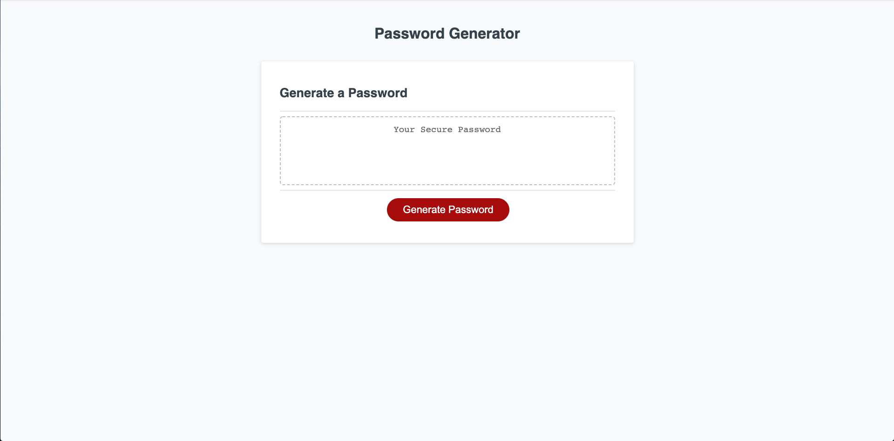

# Password-Generator

## Description 

This password generator is comprised of three different languages each complete on their own page - HTML, CSS(complete with media queries), and JavaScript

The generate button will prompt the user with a series of questions about what 
criteria they want in their password 

They will first be required to determine the length of their password: a number between 8 and 128

Then the following options include Uppercase letters, Lowercase letters, Numbers and Special Characters

Once all the prompts are answered, the password will be displayed just above the generate button in a nice, clean text box

## Technologies

* HTML 
* CSS
* Javascript

## Links

Github Repo: https://github.com/elock721/Password-Generator

Github Pages: https://elock721.github.io/Password-Generator/

## Screenshots

